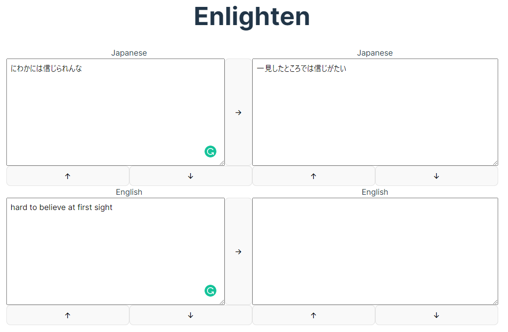

# Enlighten

英語のライティングをするときに便利なツール

うごくもの → [Enlighten](https://icy-snowflake-9758.fly.dev/)
## 起動方法

1. 下記のツールが必要です
- node.js
- pnpm
- deno

1. 下記の環境変数を設定

| Key                 | Value            |
| ------------------- | ---------------- |
| ENLIGHTEN_PORT      | 待ち受けるポート |
| ENLIGHTEN_DEEPL_KEY | DEEPLのAPIキー   |

1. 下記の順に実行

```sh
deno task pre-build
deno task build
deno run -A main.ts
```

## 使い方



- 入力後、`Ctrl+Enter` で次の欄に翻訳された内容が表示されます（↓ボタンと同義）
- `Alt+Ener`で一つ前に翻訳された内容が表示されます（↑ボタンと同義）
- →ボタンで、翻訳後に再度翻訳します。社会性フィルターがかかります。
- Grammarlyブラウザ拡張と共に使うと最高に便利。だいたい左下から始めます。